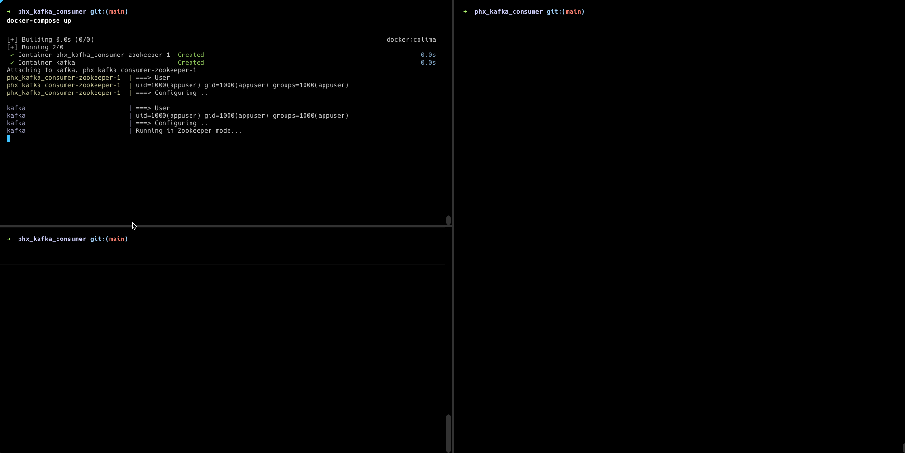

# elixir-kafka-samples

This repository contains some samples of Kafka integrations using Elixir and Erlang

```
├── README.md
├── erlang_kafka_consumer
└── phx_kafka_consumer
```

You can see instructions to use each sample

## ErlangConsumer

```
todo
```

## PhxKafkaConsumer

### Requirements

* Docker and docker-compose
* Elixir 

### Using consumer

Enter inside `phx_kafka_consumer` to start the setup

#### Up Kafka locally using docker

  * `docker-compose up`

#### Produce events 

  * `./scripts/produce-test-events.sh`

#### Start your Phoenix server:

  * Run `mix setup` to install and setup dependencies
  * Start Phoenix endpoint with `mix phx.server` or inside IEx with `iex -S mix phx.server`

Below you can see the consumer works




#### Running tests

```
mix test
```
