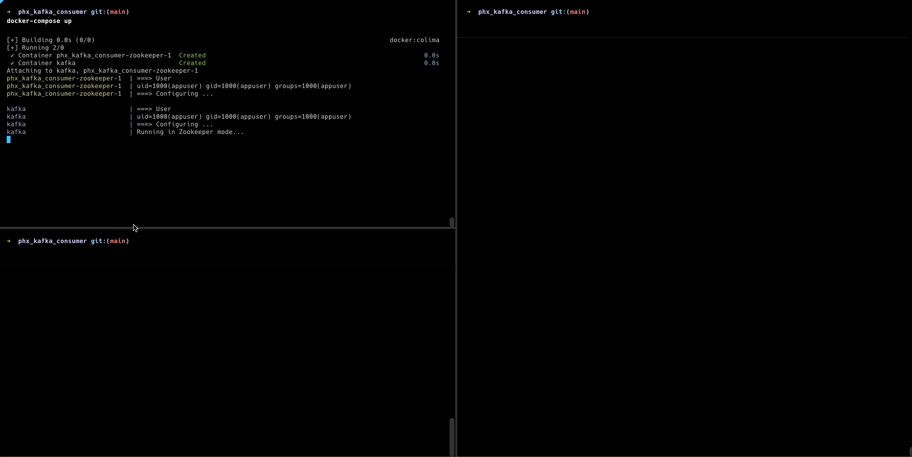

# PhxKafkaConsumer

## Requirements

* Docker and docker-compose
* Elixir 

## Start consumer

#### Up kafka locally using docker

  * `docker-compose up`

#### Produce events 

  * `./scripts/produce-test-events.sh`

### Start your Phoenix server:

  * Run `mix setup` to install and setup dependencies
  * Start Phoenix endpoint with `mix phx.server` or inside IEx with `iex -S mix phx.server`

Below you can see the consumer works

